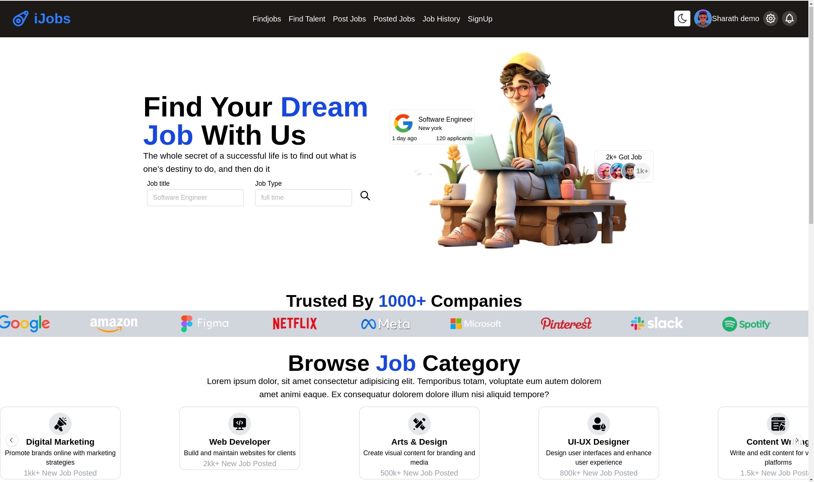
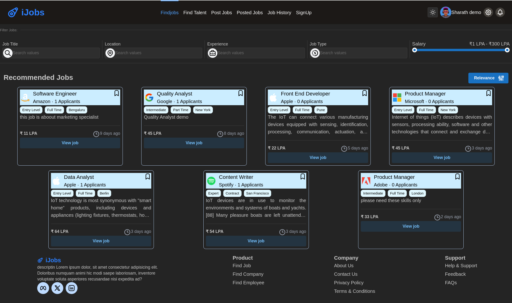

# How to use it

> Please Note:
> 
> The following folders contain the backend and frontend projects, respectively:
> - Job-Portal-Backend 
> - job-portal-ui 

```
cd job-portal-ui

npm install . --legacy-peer-deps

npm run dev
```

## before you begin, make sure you have this setup

1. create `jobportal` db/document
2. create `sequence` collection/table
3. click on `add data` -> import from json or csv file (similar to this)
4. copy the below json

``` json
[{
  "_id": "users",
  "seq": 0
},
{
  "_id": "profiles",
  "seq": 0
},
{
  "_id": "jobs",
  "seq": 0
},
{
  "_id": "notification",
  "seq": 0
}]

```

**Please Note:**

> I have not implemented JWT because, its outdated and its creating me too much bugs

Demo screenshot:

Light mode:



dark mode:


